- [User Authorization Project](#user-authorization-project)
  - [Running App](#running-app)
  - [Rules](#rules)
  - [Roles](#roles)
  - [About App](#about-app)
  - [TO DO](#to-do)
  - [Known Issues](#known-issues)
  - [Screen Shoots](#screen-shoots)
    - [Login - Register And Angular Form Validation](#login---register-and-angular-form-validation)
    - [Customer](#customer)
    - [Admin](#admin)
    - [Super Admin](#super-admin)

# User Authorization Project

Welcome to User Management App! There is 3 types (Super Admin, Admin,
Customer) of roles. This app has 6 pages (Login, Register, Home, User
Listing, 401 and 404).

> Some available accounts:
>
> - superadmin@mail.com
> - admin@mail.com
> - customer@mail.com
>
>   All passwords are same: `12345@Aa`
>
>   You could take a look to db.json for more account data.

## Running App

After install depencies with `npm start` command you can run json server and Angular development server easily.

## Rules

- All users can view Homepage when they logged in. Homepage protected by `LoginGuard (Router-Guard)` that allow to only authorized users. If user have not token will be redirect to Login page.
- Navigation provided by Navbar buttons by using `RouterLink`. User List button will be hidden if you are not Super Admin.
- User List page protected by `AdminGuard (Router-Guard)` that allow to access only users has role Super Admin. If Customer try to go User List page will be redirect to 401 - Forbidden page.
- Edit user, add user, delete user functions available in User List page.
- Username cannot be change because of used to login. Also changing the password is not allowed.
- Admin can't change user roles and can't list other admins. When admin create a user, user's role will be Customer by the default. Also Admin can delete only customers.
- Super Admin can update role and can list all users.
- Super Admin can't delete itself, but can delete other Super Admin's accounts.
- Everyone can login or register to application. But if logged user try to reach Login or Register page will be redirect to Home page. Login and Register pages protected by `NotLoginGuard (Router-Guard)`.
- This app uses `JSON Server` for creating fake database and `JSON Server Auth` to manage login - register operations. By the way auth token has 1 hour life time.

## Roles

- Super Admin _(role value: 3)_
- Admin _(role value: 2)_
- Customer _(role value: 1)_

## About App

- Created with Angular v13
- Uses Angular Material Framework for app compoments
- CSS template engine is SCSS
- Bootstrap Reboot, Bootstrap Grid, Bootstrap Tables and Bootsrap Aler imported with Sass
- Ngx Cookie Service used to handle cookies
- User ids gererated with uuid
- concurrently used to run multiple script commands in same time

## TO DO

- NGRX should be use to state managament
- Usualy i use `toPromise()` for converting observables to promise then use in async functions with await. I think it make codes more readable and avoid problems like cold observale and unsubscribe. Now `toPromise()` is depraced, need to find new method instead of it.

## Known Issues

- When Super Admin change its account role to Admin still can use Super Admin privileges. To fix this issue should be disabled role input on user form if current user is same.

## Screen Shoots

### Login - Register And Angular Form Validation

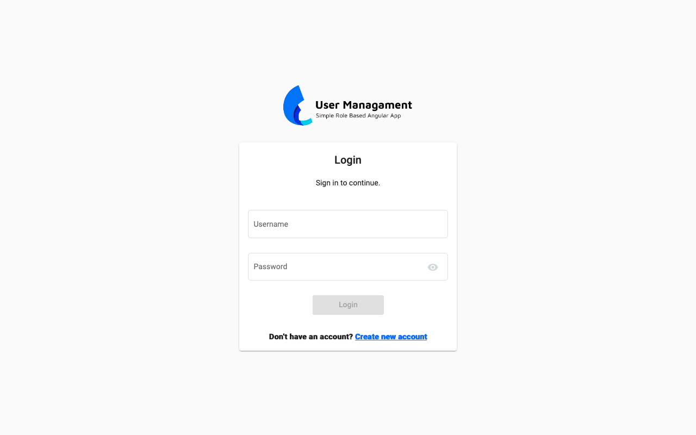

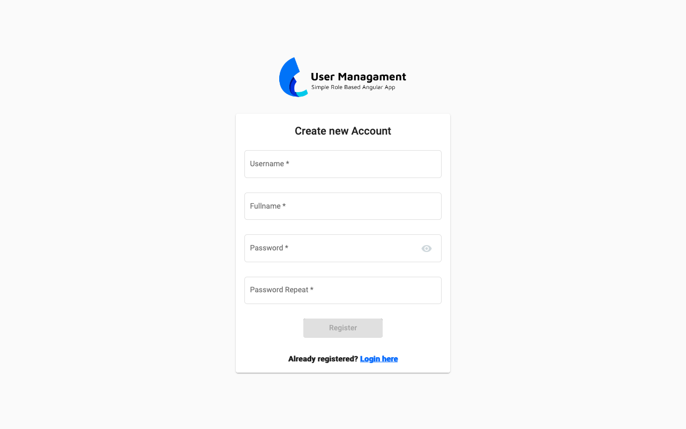

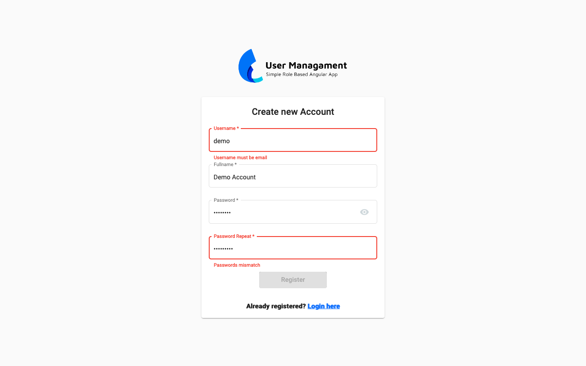

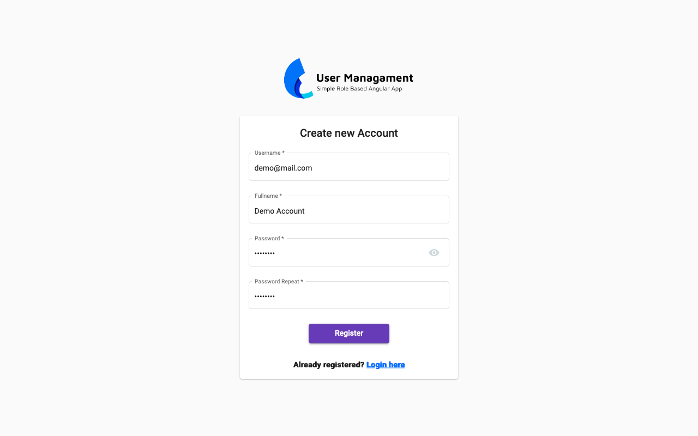

### Customer

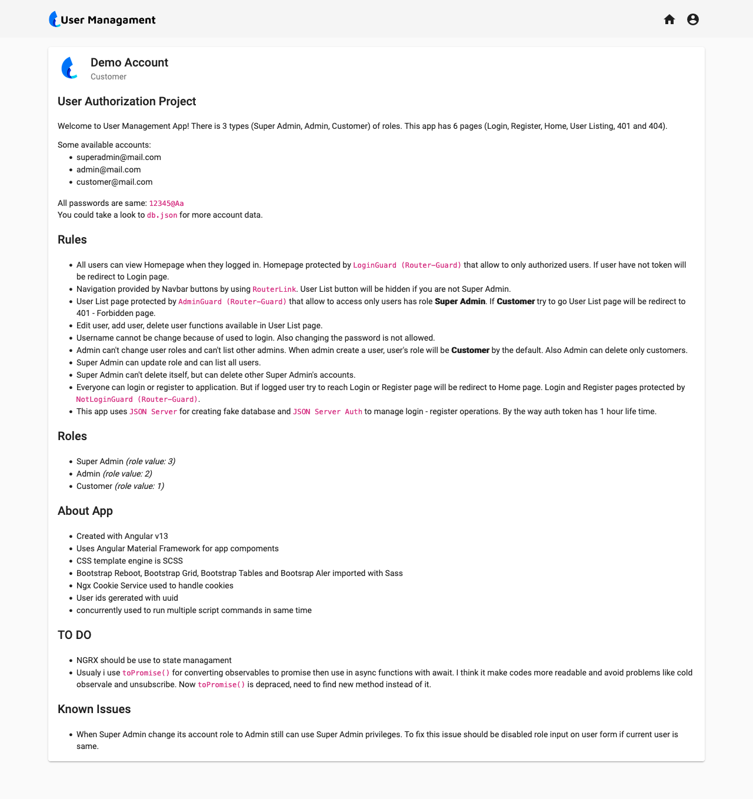

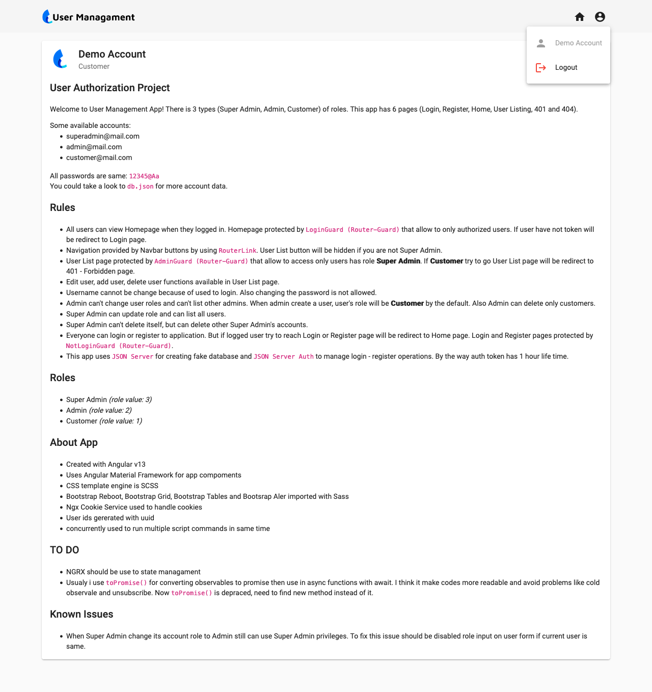

### Admin

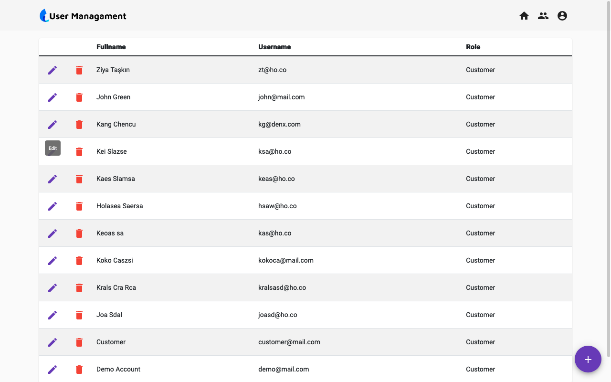

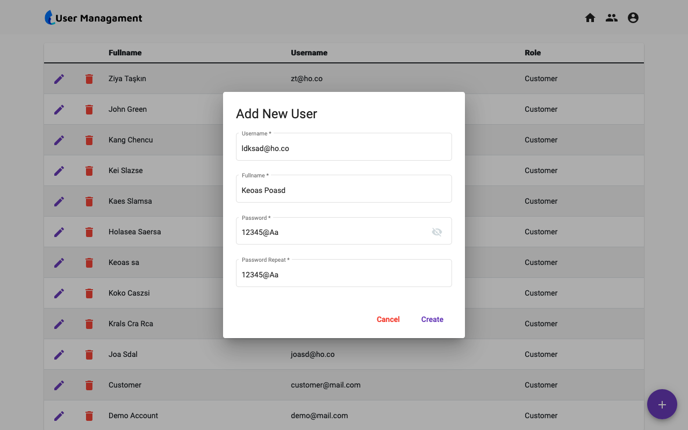

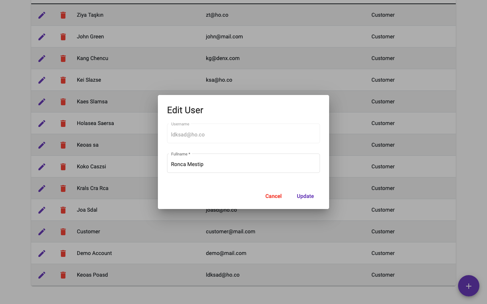

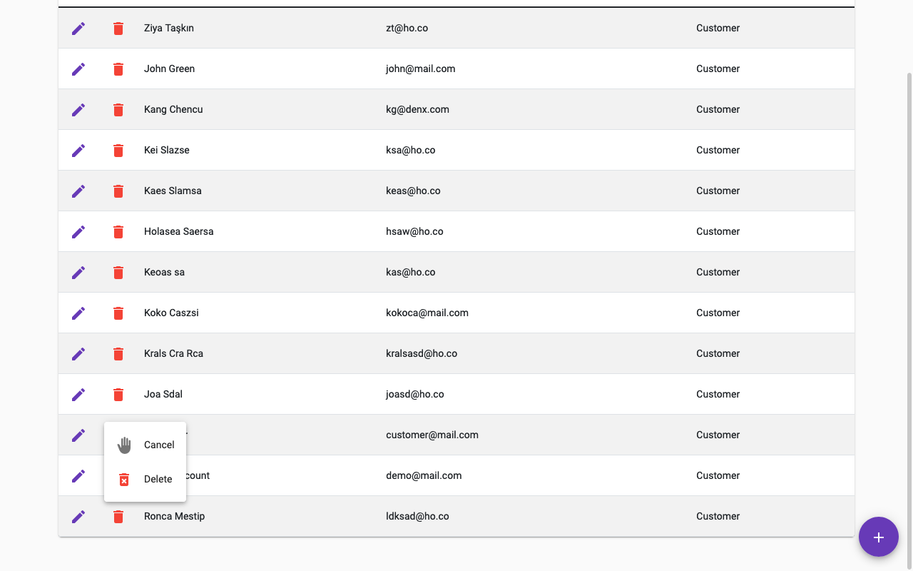

### Super Admin

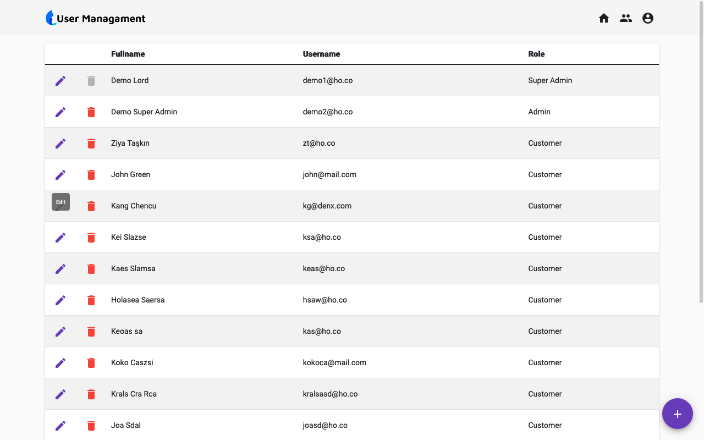

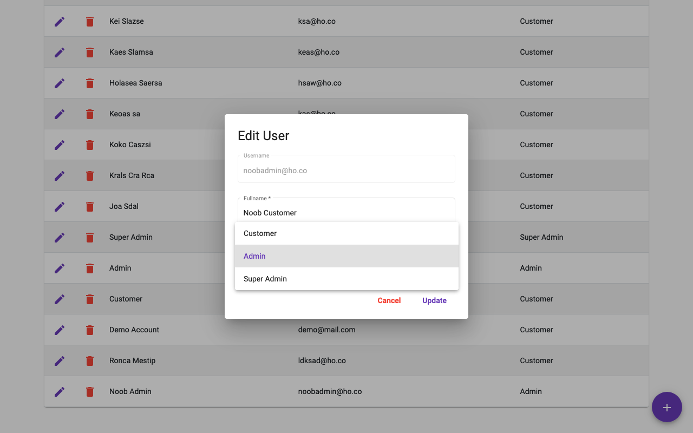

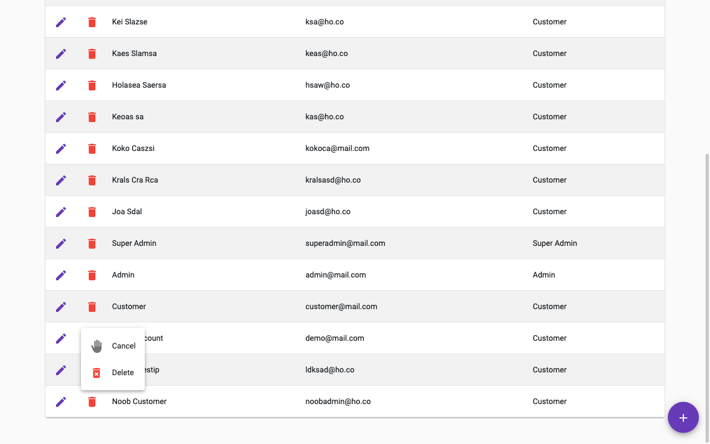
